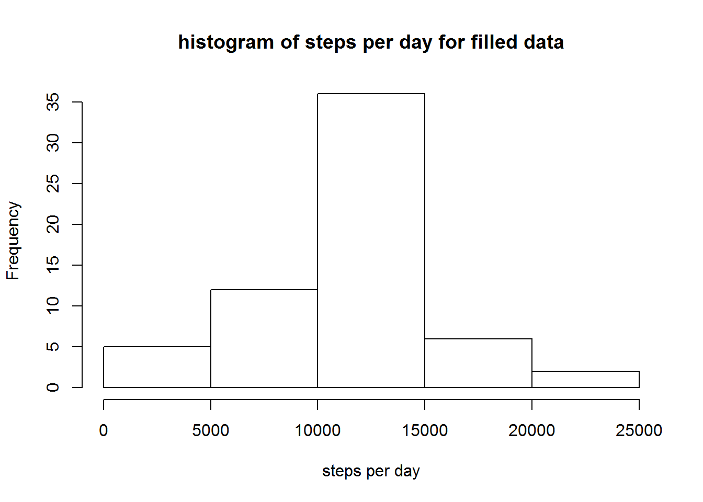

# Reproducible Research: Peer Assessment 1


## Loading and preprocessing the data


```r
activity<-read.csv("activity.csv")
```

## What is mean total number of steps taken per day?


```r
sumdate<-aggregate(activity$steps,by=list(activity$date),FUN=sum,na.omit=TRUE)
hist(sumdate$x,xlab = "steps per day",main ="histogram of steps per day")
```

 

```r
mean_total<-mean(na.omit(sumdate[,2]))
median_total<-median(na.omit(sumdate[,2]))
```

 Mean total number is 1.0767189\times 10^{4}, median is 10766

## What is the average daily activity pattern?


```r
meaninterval<-aggregate(na.omit(activity)$steps,by=list(na.omit(activity)$interval),FUN=mean)
colnames(meaninterval)<-c("interval","mean")
plot(meaninterval$interval,meaninterval$mean,main = "average daily activity",xlab = "interval",ylab = "mean steps", type = "l")
```

 

```r
maxrow<-subset(meaninterval, mean==max(meaninterval$mean))
maxinterval<-maxrow$interval
```

On average across all the days in the dataset, interval 835 contains the maximun steps.

## Imputing missing values


```r
numna<-nrow(subset(activity,is.na(activity$steps)==TRUE))
activity_na<-subset(activity,is.na(activity$steps)==TRUE)
activity_data<-subset(activity,is.na(activity$steps)==FALSE)
activity_na$step=meaninterval$mean
activity_na$steps<-NULL
colnames(activity_na)<-c("date","interval","steps")
activity_new<-rbind(activity_na,activity_data)
sumdate_new<-aggregate(activity_new$steps,by=list(activity_new$date),FUN=sum)
hist(sumdate_new$x,xlab = "steps per day",main ="histogram of steps per day for filled data")
```

 

```r
mean_new<-mean(sumdate_new[,2])
median_new<-median(sumdate_new[,2])
```

After filling in data, Mean total number is 1.0766189\times 10^{4}, median is 1.0766189\times 10^{4}.

The histogram changes little after filling the data, with mean and median also stay nearly the same. what changes is that more points gather around the mean value.And the distribution tend to be more focused.

## Are there differences in activity patterns between weekdays and weekends?


```r
activity_new$date<-as.Date(activity_new$date)
activity_new$date<-weekdays(activity_new$date)
Sys.setlocale("LC_TIME", "English")
```

```
## [1] "English_United States.1252"
```

```r
con1<-c("星期一","星期二","星期三","星期四","星期五")
con1a<-activity_new$date%in%con1
subweekday<-subset(activity_new,date<-con1a)
subweekday$date="weekday"
con2<-c("星期六","星期日")
con2a<-activity_new$date%in%con2
subweekend<-subset(activity_new,date<-con2a)
subweekend$date="weekend"
act_week<-rbind(subweekday,subweekend)
library(ggplot2)
g<-ggplot(act_week,aes(interval,steps))
g+geom_smooth()+facet_grid(.~date)
```

```
## geom_smooth: method="auto" and size of largest group is >=1000, so using gam with formula: y ~ s(x, bs = "cs"). Use 'method = x' to change the smoothing method.
## geom_smooth: method="auto" and size of largest group is >=1000, so using gam with formula: y ~ s(x, bs = "cs"). Use 'method = x' to change the smoothing method.
```

 
